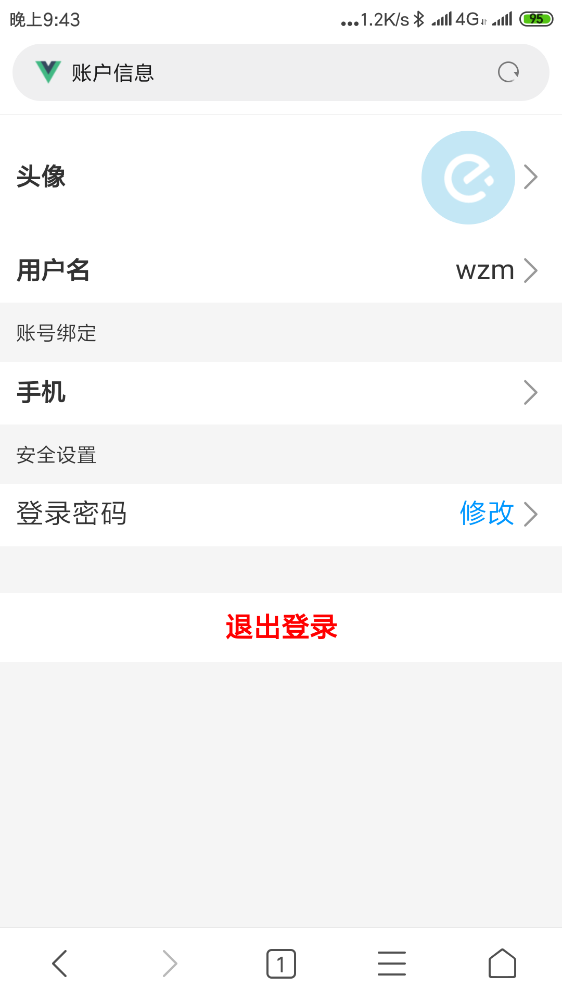

# 找工作 2020届本科毕业生

## 项目介绍
> 基于vue模仿饿了么前端页面,目前页面结构与css样式可能有点乱,部分页面没有写,有时间再梳理一下。可以手机访问<http://webstudy.club>在线查看。登录账号：13677587758,验证码：123456。

## 项目图片预览(手机页面)


|                                         |                                            |                                       |
|  ---                                    |  ---                                       |                                        |
|       |          |       |
|       |           |       |
|        |          |        |
|    |      |    |
|    |          |       |
|       |          |       |
|       |          |       |

## 总结
> 对vue的使用又有了更深的理解,其中运用了vue的自定义指令，过滤器，组件通信，计算属性，侦听器，vueRouter（路由模块化，导航守卫，路由元信息），vuex等等。

## 项目运行

```
git clone git@github.com:wangzhengmin/hunger.git

npm install

npm run serve
```


